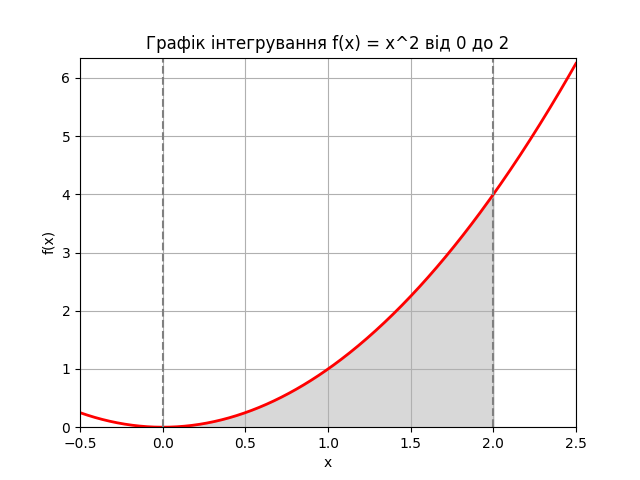

# Завдання 2. Обчислення визначеного інтеграла.

Метою даного завдання було обчислення значення інтеграла функції за допомогою методу Монте-Карло та перевірка правильність розрахунків.

## Результати розрахунків

### Числовий інтеграл
Використовуючи функцію `quad`, отримано наступні результати:
- Числовий інтеграл: **2.6666666666666665**
- Помилка: **2.9605947323337504e-14**

### Monte Carlo інтеграл
Результати для різної кількості точок:

| Кількість точок | Monte Carlo інтеграл |
|-----------------|-----------------------|
| 100             | 2.56                  |
| 1000            | 2.888                 |
| 10000           | 2.7152                |
| 100000          | 2.65104               |
| 1000000         | 2.660368             |

## Висновок

 **Метод Монте-Карло**: Результати методу Монте-Карло наближаються до аналітичного значення з ростом кількості точок. При малій кількості точок (100, 1000) похибка значна, але зі збільшенням кількості точок до 1000000 отримане значення **2.660368** стає дуже близьким до аналітичного значення. Це підтверджує, що метод Монте-Карло також є ефективним для наближених обчислень, проте для досягнення високої точності потрібно використовувати велику кількість випадкових точок. Для практичного застосування і досягнення високої точності краще використовувати числові методи, такі як `quad`, особливо коли важлива висока точність і швидкість обчислень.

## Візуалізація

Графік відображає функцію \( f(x) = x^2 \) на відрізку \([0, 2]\) та площу під кривою, що відповідає обчисленому інтегралу.
